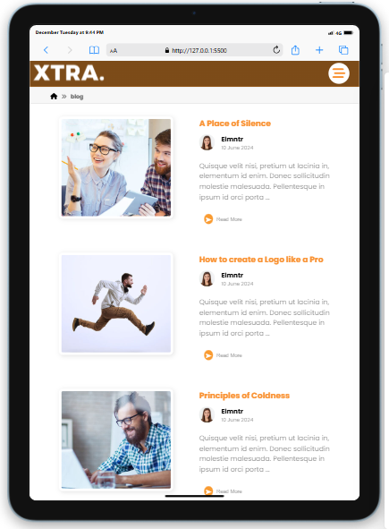
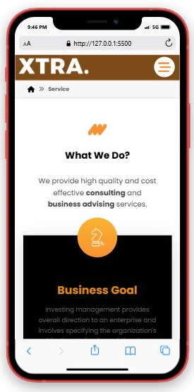
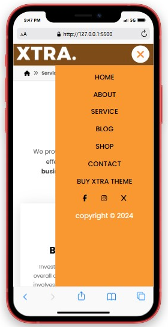

# Service Advisory Website 📘✨
Welcome to our stunning **Advisory Website** project! Built with care, precision, and teamwork, this website serves as a modern, responsive, and visually appealing platform designed to showcase advisory services.

-----------------------------------

## 🌐 Key Features

- **Responsive Design** 📱💻: Fully optimized for both mobile and desktop users.
- **Sleek Navigation** 🧭: Includes a modern, mobile-friendly **Hamburger Menu**.
- **Smooth User Experience** 🎨: Built with clean **HTML**, stylish **CSS**, and functional **JavaScript** for seamless interaction.

-----------------------------------

## 🔧 Technologies Used

- **HTML**: For the structural layout.
- **CSS**: To make it visually stunning and appealing.
- **JavaScript**: For dynamic functionality, like the hamburger menu navigation.

-----------------------------------

## 🤝 Collaboration Team

This project was brought to life through the collaboration of:

- **Eng. Abdulkadir** 🛠️
- **Eng. Abdalla** 🛠️

Together, we worked to create something that stands out and meets modern web standards!

-----------------------------------

## 📸 Screenshots and Previews

 
-----------------------------------
## 📸 Tablet Responsive

## 📸 Mobile Responsive
 
## 📬 Feedback & Support

We’d love to hear your feedback! Reach out to us for support or suggestions:

📧 Email: [Abdikadirhassan2015@gmail.com] [devabdulla252@gmail.com]

-----------------------------------

**Thank you for exploring our Advisory Website!** 🌟💻
Made with ❤️ by Eng. Abdulkadir & Eng. Abdalla.
```